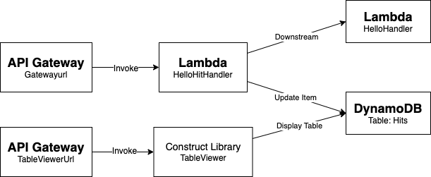
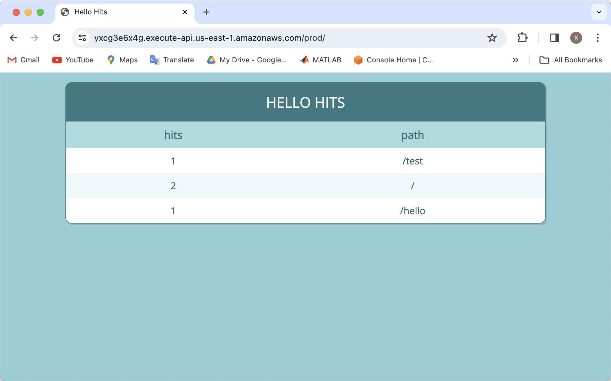
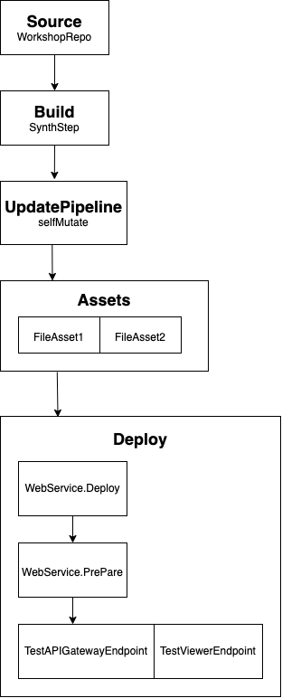

# CDK Workshop

This is a workshop project demonstrating the fundamental usage of multiple Amazon AWS Services. It also contains testing and CD Pipeline. The final result is two api endpoints: 
* `Gateway Url`: Tracks the number of hits on this url with different paths, and save the count in a DynamoDB table.
* `TableViewer Url`: Displays the full DynamoDB table. 

## AWS Services Used
* **IAM**: For creating IAM user for programmatic use and CodeCommit access
* **CloudFormation**: For modeling AWS resource deployment used in the application
* **Lambda**: For creating event handling function of the hit counter
* **DynamoDB**: For storing the respective hit count of different url paths
* **API Gateway**: For creating the gateway url of constructs
* **CloudWatch**: For viewing the log message of API calls
* **CodeCommit**: For storing the code as a git repository
* **CodePipeline**: For managing the CDK Pipeline

## Architecture


The whole project is written from scratch in TypeScript and JavaScript without using any templates. The main CDK stack is located at `/lib/cdk-workshop-stack.ts`. The structure is as follows: 

### Lambda Function: HelloHandler
This functions serves as a "Hello World" demonstration of Lambda functions. It's defined in `cdk-workshop-stack.ts`, while its handler is defined in `/lambda/hello.js` to response with a HTTP 200 greeting message and the hit url path. 

### Endpoint: Hello Hit Counter (Gatewayurl)
This endpoint is used for tracking the url hit count and response with a greeting message. It's defined as an API Gateway in `/lib/cdk-workshop-stack.ts`, invoking a Lambda function in object `HitCounter`. 

`HitCounter` class is defined in `/lib/hitcounter.ts`. It's used for initializing the DynamoDB table and defining the Lambda Function `HitCounterHandler`. This lambda function takes the deployed table name and downstream function name as environment variables, and update the counter of the corresponding path in the DynamoDB table. It then invokes the HelloHandler Lambda as downstream function. For these purposes, `HitCounterHandler` Lambda is granted the role of table read/write permissions and downstream function invoke permissions. 

For development purpose, the log message of API calls can be viewed in the AWS service **CloudWatch**. 

Example output:
```
% curl https://y37cenk6g2.execute-api.us-east-1.amazonaws.com/prod/
  Good Afternoon, CDK! You've hit /
% curl https://y37cenk6g2.execute-api.us-east-1.amazonaws.com/prod/hello
  Good Afternoon, CDK! You've hit /hello
```

### Endpoint: Table Viewer (TableViewerUrl)
This endpoint uses an external construct library `TableViewer` to display the whole table in the url using HTML. It's produced as an API Gateway as well. 



## Testing
This project also includes multiple test cases in `/test/hitcounter.test.ts`. 
* **Assertion Tests**: we tested whether DynamoDB Table is created, whether Lambda environment variable is assigned correctly, and whether DynamoDB table has encryption. 
* **Validation Tests**: we tested whether an invalid input to `HitCounter` property `readCapacity` can correctly throw errors.  

## CD Pipeline
This project contains a basic CDK Pipeline for continuous development (CD). The pipeline structure is as following: 




## Useful commands

* `npm run build`   compile typescript to js
* `npm run watch`   watch for changes and compile
* `npm run test`    perform the jest unit tests
* `cdk deploy`      deploy this stack to your default AWS account/region
* `cdk diff`        compare deployed stack with current state
* `cdk synth`       emits the synthesized CloudFormation template

## Reference
CDK Workshop: https://cdkworkshop.com/